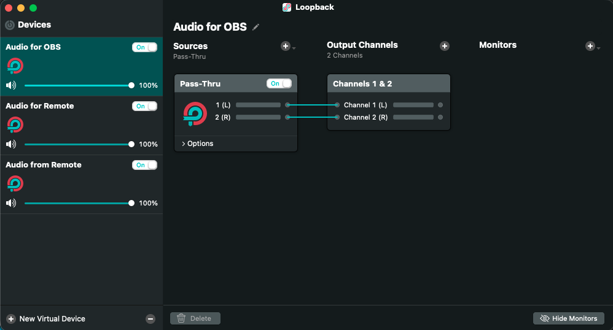
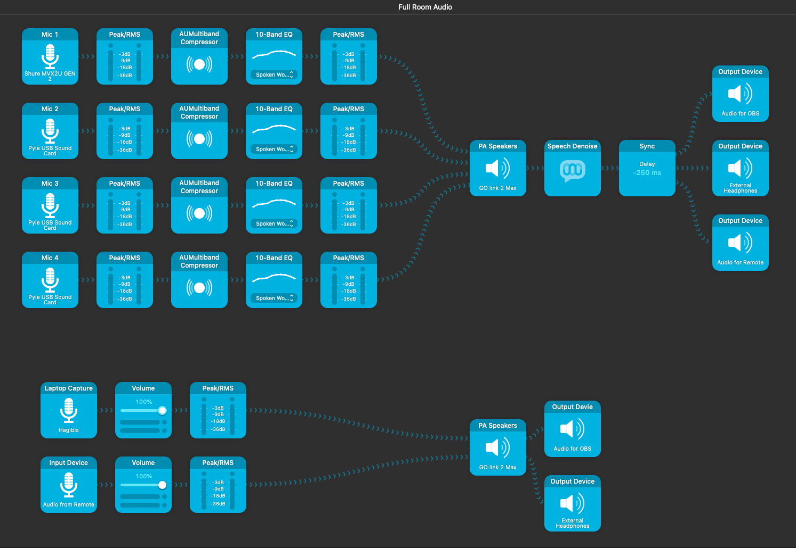

# stream-pc-config

Nix and other configuration files for PyConZA Stream PCs

## Setup new mac

1. Make sure that your user name is **streamer**
2. Install nix with `curl --proto '=https' --tlsv1.2 -L https://nixos.org/nix/install | sh`, which should be the same as the officially documented installation method.
3. Clone this config repo when in the home directory with `git clone https://github.com/PyConZA/stream_pc_config.git`
   1. Allow developer tools to be installed in order to use git.
4. Move pre-existing managed config files that will cause nix-darwin to abort installation:
   1. First restart shell if you haven't already to make sure nix is working.
   2. `sudo mv /etc/bashrc /etc/bashrc.before-nix-darwin && sudo mv /etc/zshrc /etc/zshrc.before-nix-darwin`
5. Install nix-darwin: `sudo nix run nix-darwin --extra-experimental-features "nix-command flakes" -- switch --flake ~/stream_pc_config#stream-pc`
6. Restart the shell to get `darwin-rebuild` command to work
7. To update the system after changes to the flake, use: `sudo darwin-rebuild switch --flake ~/stream_pc_config#stream-pc`

## Applications not handled by Nix or Homebrew

1. Install `apps/AudioControlBarV1.2.0.dmg` the old fashioned way (double click, drag and drop)
   1. Start it and in its settings, enable launch at login.

## Setup audio

1. In loopback, setup three loopback audio devices, all configured the same way, as shown and named in this image: 
2. Setup an audio pipeline in Audio Hijack as shown below: 
You may want to change the microphone orders once you know which mic is which.
You may also want to adjust sync delay to match the camera delay.

## Setting up OBS

1. In OBS -> Preferences -> General -> Projectors enable `Limit to one full-screen projector per screen`1
2. Use the following path to link Python to OBS: `/opt/homebrew/Cellar/python@3.11/3.11.16/Frameworks/` or similar, depending on version.
